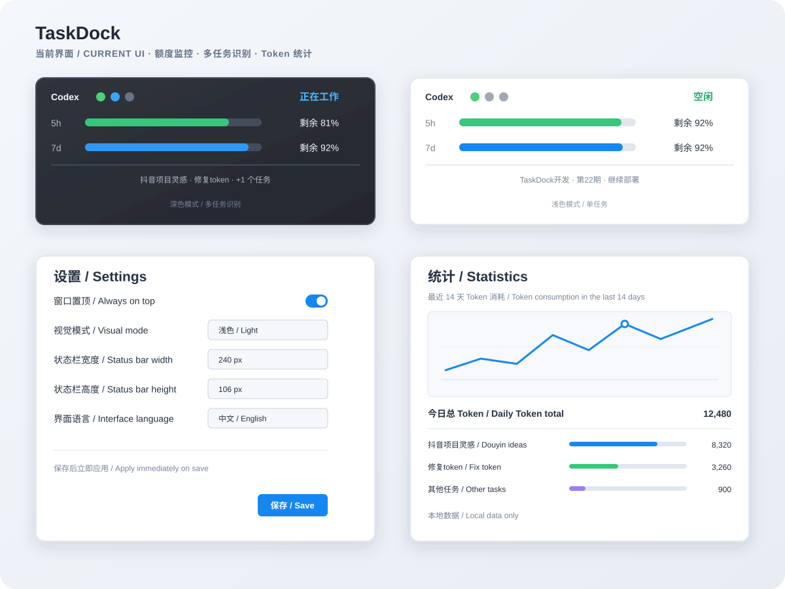

# TaskDock — Codex 额度监控、任务状态与 Token 统计栏

**TaskDock — Codex quota monitor, task status and Token statistics bar for Windows**

TaskDock 是一个面向 Windows 11 的非官方 Codex 本地状态、额度和 Token 统计工具。它在任务栏附近显示工作状态、5 小时/7 天额度、当前任务，并提供本地 Token 消耗统计。

TaskDock is an unofficial local Codex status, quota, and Token statistics tool for Windows 11. It shows activity, 5-hour and 7-day quota information, the current task, and local Token usage near the taskbar.

> TaskDock 不是 OpenAI 官方产品，也不代表 OpenAI 的授权、认可或合作关系。\
> TaskDock is not an official OpenAI product and is not affiliated with, endorsed by, or sponsored by OpenAI.

## 新界面 / New UI

## 功能 / Features

- Codex 5 小时和 7 天额度监控 / 5-hour and 7-day Codex quota monitoring
- 工作中、等待用户、完成、错误和空闲状态 / Working, waiting, completed, error, and idle states
- 多任务识别与项目名/任务名显示 / Multi-task activity with project and task names
- 本地 Token 趋势、每日总量和任务归属 / Local Token trends, daily totals, and task attribution
- 浅色/深色模式与可缩放设置窗口 / Light/dark themes and resizable Settings
- 可自定义状态栏宽度和高度 / Customizable status-bar width and height
- 托盘菜单、窗口置顶、自动停靠和位置锁定 / Tray menu, always-on-top, docking, and position locking

## 下载 / Download

[下载最新 Windows x64 版本 / Download the latest Windows x64 release](https://github.com/kc0577/TaskDock/releases/latest)

- [便携自包含版 / Portable self-contained](https://github.com/kc0577/TaskDock/releases/download/v0.2.1/TaskDock-v0.2.1-win-x64.zip)：无需安装 .NET / No .NET installation required
- [精简版 / Lightweight framework-dependent](https://github.com/kc0577/TaskDock/releases/download/v0.2.1/TaskDock-v0.2.1-win-x64-framework-dependent.zip)：需要 [.NET 8 Desktop Runtime](https://dotnet.microsoft.com/download/dotnet/8.0) / Requires .NET 8 Desktop Runtime

解压后运行 `TaskDock.exe`。当前版本未进行代码签名，Windows SmartScreen 可能提示未知发布者；请核对 Release 页面，不要关闭系统安全保护。\
Extract the ZIP and run `TaskDock.exe`. The current release is not code-signed, so Windows SmartScreen may show an unknown-publisher warning; verify the Release page and do not disable system security protections.

## 隐私 / Privacy

TaskDock 只在本机读取 Codex app-server、session 文件、`session_index.jsonl`、`%APPDATA%\CodexBar` 和当前用户启动项，不上传代码、任务内容、日志、Token 历史、凭据或遥测数据。

TaskDock reads local Codex app-server data, session files, `session_index.jsonl`, `%APPDATA%\CodexBar`, and the current user's startup entry. It does not upload source code, task content, logs, Token history, credentials, or telemetry.

详见 / See also: [PRIVACY.md](PRIVACY.md) · [USAGE.md](USAGE.md) · [SECURITY.md](SECURITY.md)

## 支持维护 / Support

TaskDock 免费提供完整下载和功能。赞助完全自愿，仅用于支持持续维护和后续更新，不构成购买、授权、订阅或功能解锁。\
TaskDock is free to download and use. Support is voluntary and is not a purchase, license, subscription, or feature unlock.

- [爱发电：赞助开发 / Afdian](https://ifdian.net/a/TaskDock)
- [Ko-fi：Support TaskDock](https://ko-fi.com/taskdock)
- [支付宝扫码 / Alipay QR](DONATE.md)

## 许可证 / License

[MIT License](LICENSE) · [第三方声明 / Third-party notices](THIRD_PARTY_NOTICES.md)
