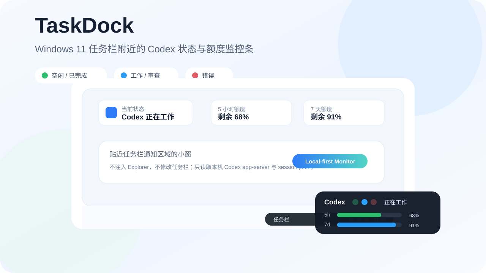
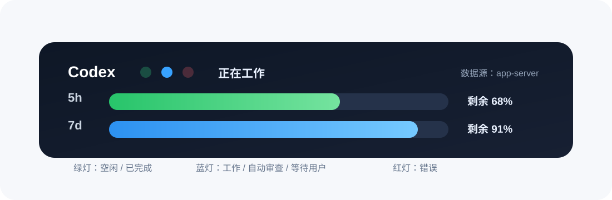

# TaskDock — Codex Usage & Quota Monitor for Windows

TaskDock is a lightweight Windows desktop monitor for Codex usage, quotas, tasks, and local token stats.

在 Windows 上查看 Codex 状态、5 小时/7 天额度、多任务进度和本地 Token 统计。

> TaskDock is an unofficial third-party tool and is not affiliated with or endorsed by OpenAI.
>
> TaskDock 是非官方第三方工具，不代表 OpenAI 的授权、认可或合作关系。

## 下载

[下载最新 Windows x64 版本](https://github.com/kc0577/TaskDock/releases/latest)

解压后运行 `TaskDock.exe`。当前版本未进行代码签名，Windows SmartScreen 可能显示未知发布者提示；请从本仓库 Release 下载并核对发布页信息，不要关闭系统安全保护。

## 功能

- Codex 5-hour and 7-day quota status
- Multiple Codex task running states
- Current task name and local token statistics
- Tray menu, pinning, position lock, and startup launch
- Light and dark visual modes

- 状态灯与 5 小时/7 天额度
- 多个 Codex 任务的运行状态
- 当前任务名称和本地 Token 统计
- 托盘菜单、置顶、位置锁定和开机启动
- 浅色/深色视觉模式

## 隐私

TaskDock 只在本机读取 Codex app-server、session 文件、`session_index.jsonl`、`%APPDATA%\CodexBar` 和当前用户启动项，不上传代码、任务内容、日志、Token 历史、凭据或遥测数据。详见 [PRIVACY.md](PRIVACY.md)。

## 支持维护

TaskDock 免费提供完整下载和功能。赞助完全自愿，仅用于支持持续维护和后续更新，不构成购买、授权、订阅或功能解锁。

- [爱发电：赞助开发](https://ifdian.net/a/TaskDock)
- [Ko-fi：Support TaskDock](https://ko-fi.com/taskdock)
- [支付宝：扫码赞助](DONATE.md)

## 许可证

- [MIT License](LICENSE)
- [第三方声明](THIRD_PARTY_NOTICES.md)
- [使用说明](USAGE.md)
- [安全说明](SECURITY.md)
